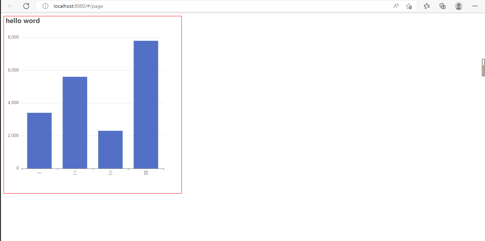
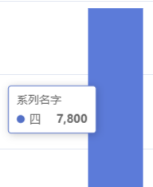

# 一、安装

`cnpm install echarts --save`

# 二、使用

## 1. 设置echarts容器

`<div ref="mychart" id="demoDiv">`  // 注：echarts的容器默认宽高是0，如果不进行设置，页面不会显示

## 2. 引用

`import * as echarts from 'echarts'`

## 3. 初始化Echarts

`let myEchart = echarts.init(this.$refs.mychart)`

## 4. 设置chart参数

```
myEchart.setOption({
            // echarts标题
            title:{
                text:'hello world'
            },
            // 配置X轴参数
            xAxis:{
                // 横坐标
                data:['一','二','三','四'],
                // 坐标轴类型，“category”类目轴，“value”数据轴
                type:"category"  
            },
            // 配置Y轴参数
            yAxis:{

            },
            // 系列，设置当前数据所能映射出的图形
            series:{
                // 这个系列的名字
                name:"系列名字",
                // 当前图表类型，bar表示柱状图
                type:'bar',
                // 数据
                data:[3400,5600,2300,7800]
            }

        })
```



# 三、配置项

## title

标题组件，包含主标题和副标题

- text：主标题文本

- link：主标题文本超链接

- target：'self' 当前窗口打开，'blank' 新窗口打开

- backgroundColor：标题背景色，默认透明

- `x:center`让标题居中

- subtext:副标题

- textStyle：color：主标题文字的颜色；fontSize：主标题文字大小；等

- subtextStyle：副标题文字样式，属性同textStyle

## tooltip

提示框组件

若配置项tooltip中没有内容，鼠标移上时则会显示series的name和当前数据的xAxis的data以及数量。



- trigger:触发类型。'item'：数据项图形触发，主要在散点图，饼图等无类目轴的图表中使用;'axis'：坐标轴触发，主要在柱状图，折线图等会使用类目轴的图表中使用;'none'：什么都不触发。

- axisPointer：坐标轴指示器配置项。
  - type：'line' 直线指示器；'shadow' 阴影指示器；'none' 无指示器；'cross' 十字准星指示器。其实是种简写，表示启用两个正交的轴的 axisPointer。

- showContent：是否显示提示框浮层，默认显示。
  
- backgroundColor：悬浮框背景颜色

- boderColor：悬浮框边框颜色

- textStyle：悬浮框文字样式等

- formatter：提示框浮层内容格式器，支持字符串模板和回调函数两种形式。

## legend

图例组件

- show：设置图例的开启或关闭

- icon：图例项的 icon。ECharts 提供的标记类型包括'circle', 'rect', 'roundRect', 'triangle', 'diamond', 'pin', 'arrow', 'none'

- top:距离chart顶部的高度

- itemWidth,itemHeight设置图例宽高

- textStyle：图例文字样式

## 柱状图series

- type:bar
- markPoint：图表标注。可以显示最大最小值
- markLine：图表标线。可以展示图表平均值
- barWidth:设置柱子宽度
- color:柱子颜色
- itemStyle：图形样式。单独设置每个柱子的颜色：
  ```
  itemStyle:{
              normal:{
                color:function(params){
                  let colorList = [
                    "#78f542",
                    "#4a4a4a",
                    "#23b245",
                    "f398f1"
                  ]
                  return colorList[params.dataIndex]
                }
              }
            },
  ```
  
若要将竖直柱状图改为横向柱状图，则将xAxis与yAxis中的内容互换。
```
    xAxis:{
        data:xData,
        type:"category"  // 坐标轴类型，“category”类目轴，“value”数据轴
    },
    yAxis:{
        type:'value'
    },
```
更改为：
```
    xAxis:{
         type:'value'
    },
    yAxis:{
        data:xData,
        type:"category"  // 坐标轴类型，“category”类目轴，“value”数据轴
    },
```

## 饼状图series

- type：pie
- radius：设置半径，`radius:["",""]`第一项内半径，第二项外半径
- label：饼图图形上的文本标签，可用于说明图形的一些数据信息，比如值，名称等。
  
  - show：是否显示标签
  - position：标签的位置，'outside'饼图扇区外侧，通过视觉引导线连到相应的扇区；'inside'饼图扇区内部；'inner' 同 'inside'；'center'在饼图中心位置。

- roseType:`roseType:area`设置成南丁格尔图

## 折线图

- type:line
- 
